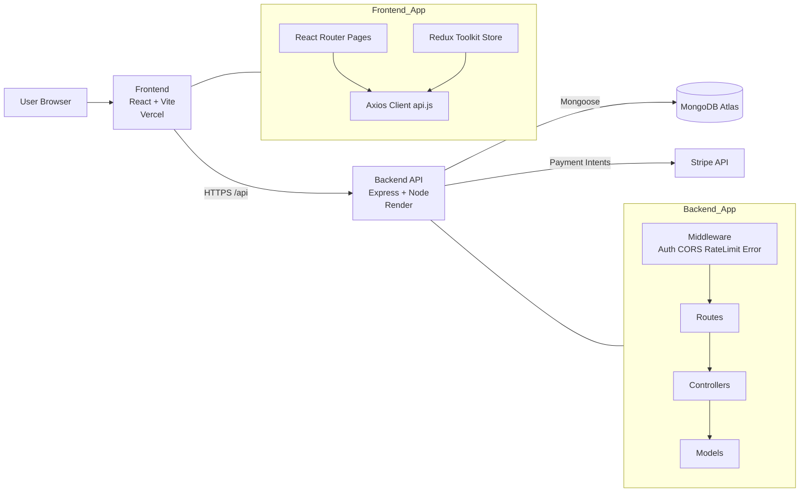
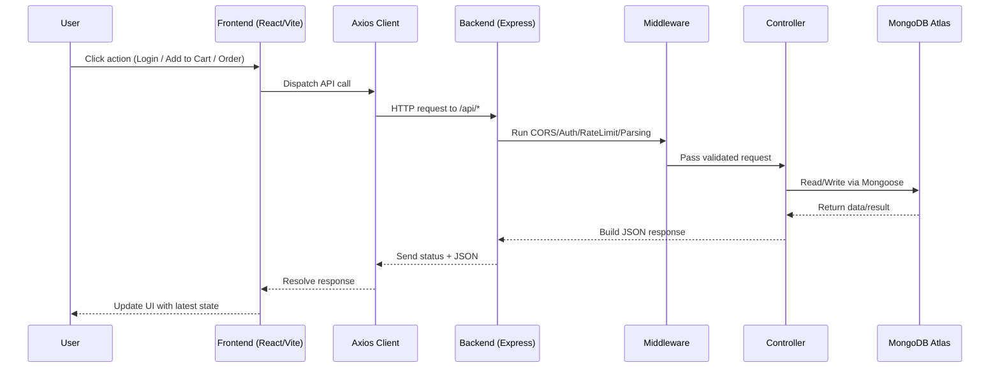

# Nexus Ecommerce Platform

A full-stack ecommerce platform with a React frontend and an Express backend.

## Tech Stack

- Frontend: React 18, Vite, Redux Toolkit, React Router, Axios, Tailwind CSS
- Backend: Node.js, Express, Mongoose, JWT, Stripe, Helmet, CORS
- Database: MongoDB Atlas
- Deployment: Vercel (frontend) + Render (backend)

## Project Structure

```text
DEVEOPS_PROJECT/
  cd ecommerce-frontend/        # Frontend app (Vite + React)
  ecommerce-backend/            # Backend API (Express + MongoDB)
  README.md                     # This file
  LICENSE
```

## Application Architecture

1. The React frontend sends requests to backend API routes under `/api`.
2. Backend validates requests (auth, role checks, business rules).
3. Controllers interact with MongoDB models through Mongoose.
4. Payment flows use Stripe API from the backend.
5. JSON responses are returned to frontend and rendered in UI.

## Architecture Diagram



## Request Flow (Frontend -> Backend -> DB)

When a user performs an action (login, fetch products, place order), the request follows this path:

1. Browser triggers an action in a React page.
2. Frontend calls Axios client in api.js.
3. Axios sends request to /api/* endpoint.
4. Express middleware runs (CORS, auth, rate limit, validation).
5. Route forwards to controller.
6. Controller uses Mongoose model to query/update MongoDB Atlas.
7. Backend returns JSON response.
8. Frontend updates Redux/UI and renders the result.



### Frontend Architecture

- Route-based pages for user, admin, seller, support, returns, wishlist, cart, checkout.
- Global state with Redux Toolkit slices (auth, cart, products).
- API client in `api.js` using Axios and auth token interceptors.
- API base URL:
  - Local: `/api` via Vite proxy
  - Hosted: `VITE_API_URL`

### Backend Architecture

- Entry files:
  - `src/server.js`: app startup and DB connection
  - `src/app.js`: middleware and route registration
- Layering:
  - `routes/` -> `controllers/` -> `models/`
- Middleware:
  - Security: Helmet, rate limiter
  - Cross-origin: CORS with `CLIENT_URLS`
  - Logging: Morgan
  - Error handling: centralized not-found and error middleware

## Features (Implemented)

### Authentication and Access

- User registration and login
- JWT-based protected APIs
- Profile fetch for logged-in users
- Role-based access control (user, seller, admin)
- Seller approval request flow
- Route guards for protected/admin/seller pages

### Storefront and Catalog

- Home page, about page, and collections page
- Product catalog listing
- Product details page
- Featured products endpoint
- Product search endpoint
- Product image proxy endpoint
- Product review submission

### Cart, Checkout, and Orders

- Cart state management (Redux)
- Checkout page (protected)
- Place order API
- My orders API
- Order details by ID
- User order cancel API
- User item-level return request from order

### Payments

- Stripe payment intent creation endpoint
- Payment methods management:
  - Add payment method
  - List payment methods
  - Set default payment method
  - Delete payment method

### Wishlist

- Add/remove wishlist items
- Get wishlist items
- Check product in wishlist
- Wishlist item count endpoint
- Price-drop notification toggle per product

### Address Book

- Add address
- Update address
- Delete address
- List addresses
- Set default address

### Returns and Refund Workflow

- Create return request
- User returns listing
- Seller returns listing
- Seller approve/reject return request
- Admin list all returns
- Admin mark return as received

### Promotions

- Create promotion
- List active promotions
- Validate promo code against cart total
- List promotions created by logged-in creator
- Update promotion
- Delete promotion

### Support Tickets

- Create support ticket
- Add messages to a ticket thread
- View my tickets
- View ticket by ID
- Admin view all tickets
- Admin update ticket status

### Seller Module

- Seller dashboard route
- Seller product CRUD
- Seller order listing
- Seller item status updates:
  - Mark item as shipped
  - Mark item as delivered
  - Update item return status

### Admin Module

- Admin dashboard stats
- Return analytics endpoint
- Low-stock products endpoint
- Admin users management (list/delete)
- Admin orders management:
  - List all orders
  - Update order status
  - Update specific order item status
- Seller approvals management:
  - List pending sellers
  - Approve seller
  - Reject seller
- Admin support panel route

### UI and UX

- Toast notifications
- Scroll-to-top on route change
- Custom 404 page
- Responsive layout with shared navbar/footer

## Local Setup (Another Laptop)

### 1. Prerequisites

- Node.js 18+ (LTS recommended)
- npm 9+
- Git
- MongoDB Atlas cluster URI
- Stripe test keys

### 2. Clone and open project

```bash
git clone https://github.com/2303A52288/nexus-ecommerceplatform.git
cd nexus-ecommerceplatform/DEVEOPS_PROJECT
```

### 3. Install dependencies

Frontend:

```bash
cd "cd ecommerce-frontend"
npm install
```

Backend:

```bash
cd ../ecommerce-backend
npm install
```

### 4. Configure environment variables

Backend:

```powershell
cd "d:\FULL_STACK_PROJECT_SRU\DEVEOPS_PROJECT\ecommerce-backend"
Copy-Item .env.example .env
```

Update backend `.env`:

```env
PORT=5000
NODE_ENV=development
MONGODB_URI=mongodb+srv://<username>:<password>@cluster.mongodb.net/ecommerce?retryWrites=true&w=majority
MONGODB_DB=ecommerce
JWT_SECRET=replace-with-a-long-random-secret
CLIENT_URL=http://localhost:3000
CLIENT_URLS=http://localhost:3000
STRIPE_SECRET_KEY=sk_test_replace_me
STRIPE_WEBHOOK_SECRET=whsec_replace_me
ADMIN_NAME=Admin User
ADMIN_EMAIL=
ADMIN_PASSWORD=
ADMIN_PHONE=9999999999
```

Frontend:

```powershell
cd "d:\FULL_STACK_PROJECT_SRU\DEVEOPS_PROJECT\cd ecommerce-frontend"
Copy-Item .env.example .env
```

Update frontend `.env`:

```env
VITE_STRIPE_PUBLISHABLE_KEY=pk_test_replace_me
VITE_API_URL=http://localhost:5000/api
```

### 5. Run project

Backend terminal:

```bash
cd ecommerce-backend
npm run dev
```

Frontend terminal:

```bash
cd "cd ecommerce-frontend"
npm run dev
```

Local URLs:

- Frontend: http://localhost:3000
- Backend: http://localhost:5000
- API health: http://localhost:5000/api/health

### 6. Optional seed command

```bash
cd ecommerce-backend
npm run seed:admin
```

## Deployment

### Backend on Render

- Blueprint file is configured in repository root as `render.yaml`.
- Render service uses root directory: `DEVEOPS_PROJECT/ecommerce-backend`.
- Required Render env vars:
  - `MONGODB_URI`
  - `MONGODB_DB`
  - `JWT_SECRET`
  - `STRIPE_SECRET_KEY`
  - `STRIPE_WEBHOOK_SECRET`
  - `CLIENT_URLS` (include Render frontend URL)

### Frontend on Render

- Root directory: `DEVEOPS_PROJECT/cd ecommerce-frontend`
- Build command: `cd "cd ecommerce-frontend" && npm install && npm run build`
- Output directory: `dist`
- Required env vars:
  - `VITE_API_URL=https://<your-backend>.onrender.com/api`
  - `VITE_STRIPE_PUBLISHABLE_KEY=<your-publishable-key>`

## Available Scripts

Frontend (`cd ecommerce-frontend`):

- `npm run dev`
- `npm run build`
- `npm run preview`

Backend (`ecommerce-backend`):

- `npm run dev`
- `npm start`
- `npm run seed:admin`

## Troubleshooting

- Frontend cannot call backend:
  - Ensure `VITE_API_URL` is correct and backend is running.
- CORS error in production:
  - Add your exact Vercel frontend URL to `CLIENT_URLS`.
- MongoDB connection error:
  - Check Atlas IP allowlist, username/password, and URI.
- Stripe errors:
  - Verify test keys are set in both frontend and backend env files.
- Space in folder name issue:
  - Always quote `cd ecommerce-frontend` path in terminal commands.
